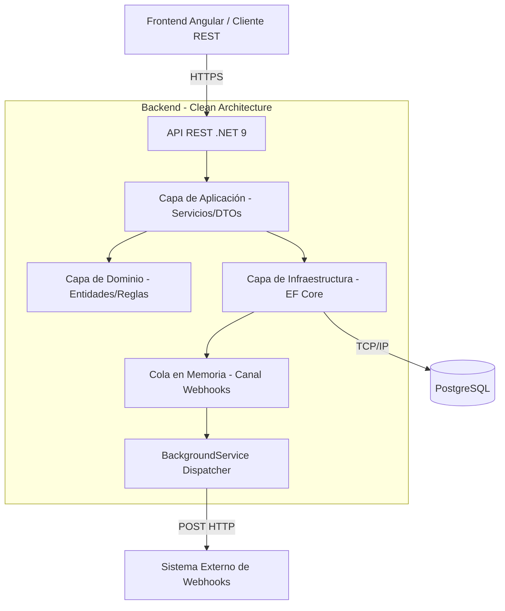

# Decisiones Técnicas y Arquitectura - OPA SAS

Este documento responde a los requerimientos teóricos, de negocio y arquitectónicos planteados en la prueba técnica.

---

## 1. Reglas de Negocio y Transiciones de Estado
**¿Dónde se implementaron las reglas de negocio y por qué?**
*   Las reglas de validación de entrada (ej: `valorSolicitado > 0`, `numeroCuotas > 0`) se implementaron en la capa de **Aplicación** utilizando **FluentValidation** (`CrearCreditoValidator`). Esto permite validar las peticiones rápidamente antes de que toquen la lógica pesada, manteniendo los controladores (API) limpios.
*   Las reglas de **transiciones de estado** (ej: no pasar de `Rejected` a `Disbursed`) y la **inmutabilidad de campos** se validan directamente en el corazón del Dominio: en la entidad **`Credit.cs`** (Domain-Driven Design).
*   *¿Por qué ahí?* Porque las reglas de negocio puras pertenecen a la entidad. Al centralizarlas en `Credit.cs` usando `BusinessRuleException`, nos aseguramos de que es físicamente imposible que cualquier servicio o controlador modifique un crédito saltándose las reglas financieras.

---

## 2. Webhook - Integración Externa
**Estrategia frente a fallos del sistema externo**
El envío del webhook se implementó de forma **asíncrona y desacoplada**. Cuando se crea un crédito, la transacción se completa rápidamente para el usuario, y el evento se envía a un canal en memoria (`IWebhookQueue`). Un proceso en segundo plano (`WebhookDispatcherService` - un `BackgroundService`) se encarga de enviarlo.

**¿Qué ocurre si el sistema externo no responde o devuelve error?**
1.  **Encolamiento y Retries:** El servicio en segundo plano está diseñado (o puede configurarse fácilmente mediante librerías como *Polly*) para implementar reintentos exponenciales.
2.  **Aislamiento:** La falla del webhook **NO** afecta la creación del crédito (el usuario no recibe un error 500 si el webhook falla).
3.  **Trazabilidad:** Queda registro en los logs del sistema sobre el fallo del webhook. En una versión más madura, los eventos fallidos podrían pasar a una tabla de base de datos o una "Dead Letter Queue" para revisión manual o reintento posterior.

---

## 3. Seguridad
**Justificación del mecanismo utilizado**
Se implementó seguridad basada en **JSON Web Tokens (JWT)**.
*   **¿Por qué JWT?** Es el estándar moderno para APIs REST stateless. Permite que la API valide la identidad y los permisos sin necesidad de consultar constantemente una base de datos de sesiones, facilitando la escalabilidad horizontal.
*   Los endpoints críticos están protegidos con el atributo `[Authorize]`, garantizando que solo clientes o usuarios autenticados con un token válido puedan realizar operaciones.

---

## 4. Auditoría y Trazabilidad
Al tratarse de un sistema financiero, implementamos una entidad `CreditHistory`.
*   **Información Mutable:** El `Status` del crédito es mutable, al igual que posiblemente la fecha de `UpdateDate`.
*   **Información Inmutable:** El `RequestedValue`, `InterestRate`, `NumberOfInstallments` y los datos del asociado (`AssociateId`) **no deben modificarse** una vez creado el crédito (y está estrictamente bloqueado en el código si el crédito ya fue Desembolsado, Cancelado o Rechazado). Cualquier alteración financiera mayor requeriría anular la solicitud y crear una nueva. Todo cambio de estado genera automáticamente un registro inmutable en `CreditHistory`.

---

## 5. Despliegue y Arquitectura a Producción
### Cómo se expondría en un ambiente productivo
1.  **HTTPS:** La API debe estar detrás de un Reverse Proxy (como Nginx o Azure API Management / AWS API Gateway) que termine la conexión SSL/TLS, garantizando tráfico cifrado.

### Diagrama de Arquitectura

*   **Stateless:** La `API REST`, la `Capa de Aplicación` y los `Controladores` son completamente *stateless* (no guardan estado en memoria entre peticiones). Esto permite escalar horizontalmente agregando más contenedores o servidores sin conflicto.
*   **Stateful:** La base de datos `PostgreSQL` es el único componente que conserva estado persistente (*stateful*). La `Cola en Memoria` temporalmente guarda estado, por lo que en un ambiente productivo masivo se reemplazaría por una herramienta distribuida como RabbitMQ, Kafka o AWS SQS.
2.  **Variables y Secretos:** En lugar de usar `appsettings.json`, en producción se usarían servicios de gestión de secretos como **Azure Key Vault** o **AWS Secrets Manager** inyectados en tiempo de ejecución.
3.  **Base de Datos (SQL Server / PostgreSQL):** Usaríamos servicios administrados (Azure SQL Database o AWS RDS) con Backups automatizados diarios (PaaS), retención en un punto del tiempo, y cifrado en reposo (TDE).
4.  **Health Checks:** Se implementarían endpoints `/health` (propios de .NET) para que un orquestador (como Kubernetes) sepa si el servicio está vivo (Liveness) y listo para recibir tráfico (Readiness).
5.  **CI/CD:** Pipeline en GitHub Actions o Azure DevOps. Al hacer un push a `main`: se ejecutan las pruebas automatizadas -> se construye la imagen de Docker -> se empuja a un Container Registry -> se despliega a un servicio como Azure App Service o Kubernetes.

### Stateless vs Stateful
*   **Stateless (Sin estado):** El **Backend (API REST)** y el **Frontend**. Pueden morir y reiniciarse sin perder información, facilitando la creación de múltiples instancias para balancear la carga.
*   **Stateful (Con estado):** La **Base de Datos (PostgreSQL)** y el **Servicio de Webhook** (si usara colas persistentes como RabbitMQ en lugar de memoria).

---

## 6. Escalabilidad
**Pregunta:** *Si el sistema inicialmente maneja 500 créditos mensuales, pero en dos años debe manejar 500.000 y múltiples entidades cooperativas, ¿qué modificaría en su arquitectura?*

1.  **Multi-Tenancy (Múltiples Entidades):** Agregaríamos un `TenantId` a todas las tablas (o un esquema/base de datos por entidad) para aislar la información de cada cooperativa asegurando que un usuario de la cooperativa A no vea los datos de la B.
2.  **Caché Distribuida:** Con cientos de miles de registros, usaríamos **Redis** para cachear respuestas frecuentes (ej. consultas al listado de créditos paginado, configuraciones) reduciendo la carga a la base de datos.
3.  **Lecturas vs Escrituras (CQRS & Read Replicas):** Configuraríamos réplicas de lectura en la Base de Datos. Todas las operaciones `GET` irían a la réplica, y las `POST/PUT/PATCH` a la base de datos Master.
4.  **Message Broker Real:** El webhook dejaría de ser un proceso en memoria y pasaría a utilizar **RabbitMQ**, **Kafka** o **AWS SQS**. De esta forma, si hay picos de miles de créditos creados por segundo, los eventos se encolan sin desbordar la memoria y múltiples *Workers* los van procesando a un ritmo controlado.
5.  **Indexación y Particionamiento:** Se aplicarían índices optimizados sobre los campos más filtrados (estado, identificacionAsociado) y particionamiento en tablas históricas para agilizar las queries.
